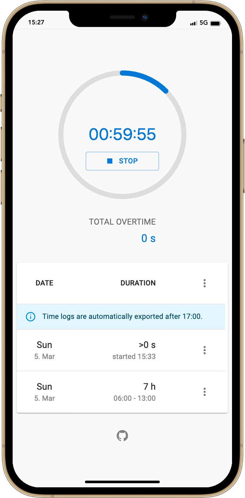
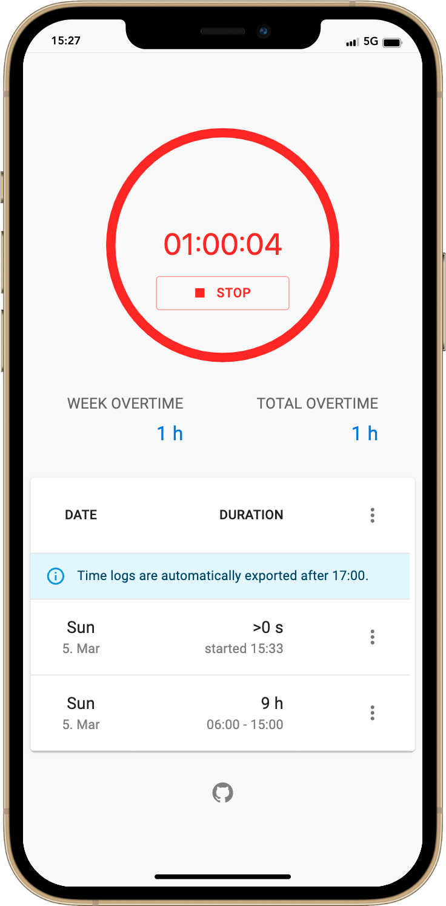

# Overtimer

Track working time with focus on overtime statistics.

## Motivation

A lot of other apps are too sophisticated and contain too many features which make the UX cumbersome. This app was designed to focus on a very simple UX to achieve the daily tasks with as less clicks as possible.

| Default state | State with overtime |
|---|---|
|  |  |

## Features

* Start/stop timer
* Start timer with setting start time when you're already working 
* Show weekly and total overtime for last 8 weeks
* Export/import time logs in JSON format
* Daily backups after 17:00 when stopping the timer
* Limit timelogs to 8 full weeks

## Getting started

1. `npm install`
2. `npm run dev`
3. Open http://localhost:3000
